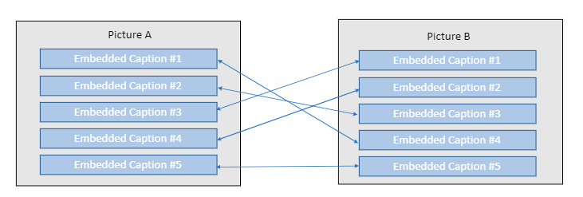

# Codenames Pictures

Try the game [here](http://35.178.211.37/)
## Description
* In Codenames Pictures two teams compete by each having a Spymaster give one word clues which refer to multiple pictures on the board. 
* The other players on the team attempt to guess their team's pictures while avoiding the pictures of the other team.
* We propose a variant where the Spymaster gives pictures as clues rather than words.
* This project demonstrates that in this variant the computer can successfully play the role of a good Spymaster.

## Preprocessing
We begin by downloading 5000 pictures and their captions from [coco](http://cocodataset.org/#overview)

Pictures which aren't square enough are removed as they won't fit on the board, leaving us with 3242 pictures.

Each picture has 5 captions, which we embed into a vector space using a pretrained BERT model available in the [sentence-transformers](https://github.com/UKPLab/sentence-transformers) package. 

In this vector space, sentences which are semantically similar lie close together (under the cosine metric).

We define the distance between two pictures as the earth mover's distance between their sets of embeddings. 

This distance is the minimal cost required to transform one set of embeddings to the other.

For clarity's sake, we then transform these distances to a score in the range 0 to 100, with a score of 100 indicating that two pictures and a perfect match and a score of 0 indicating that two pictures are totally distinct.

As we only have 3242 images, we can afford to store the pairwise scores in a numpy array; its size is 20 MB so it can be loaded from memory quickly.

Full details of this entire pipeline are given [here](misc/coco/BERT.ipynb).

### Prediction

Now that we have a similarity score between any two pictures, prediction is remarkably easy.

We propose a picture as a clue, and retrieve all the similarity scores between it and the pictures on the board.

Then we sort the scores in order of decreasing similarity, multiple the scores of the non-blue pictures by minus one, and then take a 'decaying sum' of the scores.

It is the player's job to set the decay for the score function, with a greater decay leading to the clue linking more words.

We calculate the score for all possible clues, then take the clue with the highest score. Simple.

Full details can be found [here](libs/prediction.py)

